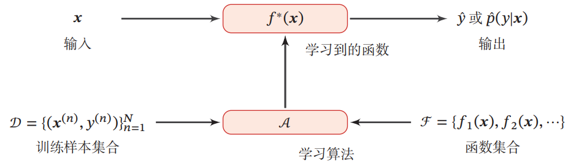

# 基本概念
- 特征:物体具有的某种特性
- 标签:需要预测的某种属性，可以是连续值，也可以是离散值
- 样本:标记好的特征和标签可以视为一个样本
- 数据集:一组样本构成的集合
- 训练集:用来训练模型的数据集 
- 测试集:用来检验模型好坏的数据集
- 特征向量:所有特征构成的向量

## 机器学习系统
机器学习：通过算法使得机器能从大量数据中学习规律从而对新的样本做决策。

# 机器学习的三要素
## 模型
### 线性模型
$$
f(\boldsymbol{x} ; \theta)=\boldsymbol{w}^{\top} \boldsymbol{x}+b
$$
其中参数 $\boldsymbol{x}$ 包含了权重向量 $\boldsymbol{w}$ 和偏置 $b$。
### 非线性模型
广义的非线性模型可以写为多个非线性基函数 $\phi(x)$ 的线性组合:
$$
f(\boldsymbol{x} ; \theta)=\boldsymbol{w}^{\top} \phi(\boldsymbol{x})+b
$$
其中: $\phi(\boldsymbol{x})=\left[\phi_1(\boldsymbol{x}), \phi_2(\boldsymbol{x}), \cdots, \phi_K(\boldsymbol{x})\right]^{\top}$ 为 $𝐾$ 个非线性基函数组成的向量，参数 $\boldsymbol{x}$ 包含了权重向量 $\boldsymbol{w}$ 和偏置 $b$。   

如果 $\phi(x)$ 本身为可学习的基函数，比如:
$$
\phi_k(\boldsymbol{x})=h\left(\boldsymbol{w}_k^{\top} \phi^{\prime}(\boldsymbol{x})+b_k\right), \forall 1 \leq k \leq K
$$
其中 $h(\cdot)$ 为非线性函数，$\phi^{\prime}(\boldsymbol{x})$ 为另一组基函数，$\boldsymbol{w}_k$ 和 $b_k$ 为可学习的参数， 则 $f(\boldsymbol{x} ; \theta)$ 就等价于神经网络模型。

## 学习准则
模型 $𝑓(𝒙; \theta)$ 的好坏可以通过期望风险 $\Re(\theta)$ 来衡量，其定义为:
$$
\Re(\theta) = E_{(x,y)\sim p_{r}(x,y)}[L(y,f(x;\theta)] 
$$
其中，$p_{r}(x,y)$ 为真实的数据分布，$L(y,f(x;\theta))$ 为损失函数，用来量化两个变量之间的差异。

### 损失函数
损失函数是一个非负实数函数， 用来量化模型预测和真实标签之间的差异。

#### 0-1 损失函数
最直观的损失函数是模型在训练集上的错误率， 即 0-1 损失函数:
$$
L(y,f(x;\theta))\begin{Bmatrix} 0 \quad if  \ y = f(x;\theta)
 \\  1 \quad if  \ y \ne  f(x;\theta)
\end{Bmatrix}
= I(y \ne  f(x;\theta))
$$

其中 $𝐼(\cdot)$ 是指示函数，虽然 0-1 损失函数能够客观地评价模型的好坏，但其缺点是数学性质不是很好：不连续且导数为 0，难以优化。因此经常用连续可微的损失函数替代。

